# TaskFlow

<div align="center">

.png)

### **Modern Team Collaboration & Task Management Platform**

*A full-stack web application built with PHP, MySQL, and Vanilla JavaScript showcasing production-ready development practices*

[](https://php.net)
[](https://tidbcloud.com)
[](https://www.docker.com)
[](https://render.com)

[🚀 Live Demo](https://taskflow-wbld.onrender.com) • [Screenshots](#-screenshots) • [Deployment Guide](#-deployment) • [Documentation](#-documentation)

</div>

---

## 🎯 About TaskFlow

TaskFlow is a **comprehensive project management system** designed to help teams organize, track, and collaborate on projects efficiently. Built from scratch without frameworks to demonstrate **full-stack development expertise**, security-first architecture, and modern web development practices.

### **Why TaskFlow Stands Out**

- 🎨 **Intuitive Interface** - Clean, responsive design inspired by Linear and Asana
- 🔒 **Security-First** - CSRF protection, prepared statements, XSS prevention, bcrypt hashing
- 🚀 **Real-time Interactions** - AJAX-powered operations without page reloads
- 📱 **Fully Responsive** - Seamless experience across all devices
- 🌙 **Smart Dark Mode** - System-aware theme with smooth transitions
- 🤖 **Automated Maintenance** - Free cron jobs via cron-job.org (every 2 hours)
- 📊 **Production Ready** - Docker deployment, environment variables, demo data protection
- ☁️ **Cloud-Native** - Deployed on Render.com with TiDB Cloud (5GB free forever)

---

## ✨ Core Features

### **Project & Task Management**
- ✅ Create and organize unlimited projects with status tracking
- ✅ Kanban board with drag-and-drop across three columns (TODO, In Progress, Completed)
- ✅ Priority levels (Low, Medium, High) with color coding
- ✅ Due dates with overdue detection
- ✅ Task assignments and team collaboration
- ✅ File attachments (10MB max, multiple formats supported)
- ✅ Comments and activity logging for audit trails

### **User Experience**
- ✅ Role-based access control (Admin, Member, Owner)
- ✅ Dark mode with localStorage persistence
- ✅ Toast notifications for all actions
- ✅ Form validation with inline error messages
- ✅ Auto-save functionality to prevent data loss
- ✅ Mobile-optimized navigation
- ✅ Password strength validator with real-time feedback

### **Developer Features**
- ✅ RESTful AJAX API (14 endpoints)
- ✅ Docker containerization with PHP 8.2 + Apache
- ✅ Automated user cleanup with external cron service
- ✅ Demo data protection for portfolio stability
- ✅ Modular JavaScript (10 ES6+ modules)
- ✅ Normalized database schema (8 tables, 3NF)
- ✅ Environment variables for cloud deployment
- ✅ Comprehensive error handling and logging

---

## 📸 Screenshots

### Desktop Experience

<div align="center">

**Dashboard Overview**
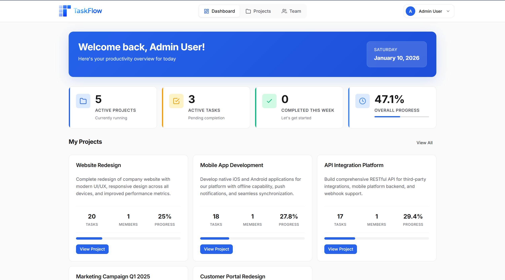

**Kanban Board with Drag & Drop**
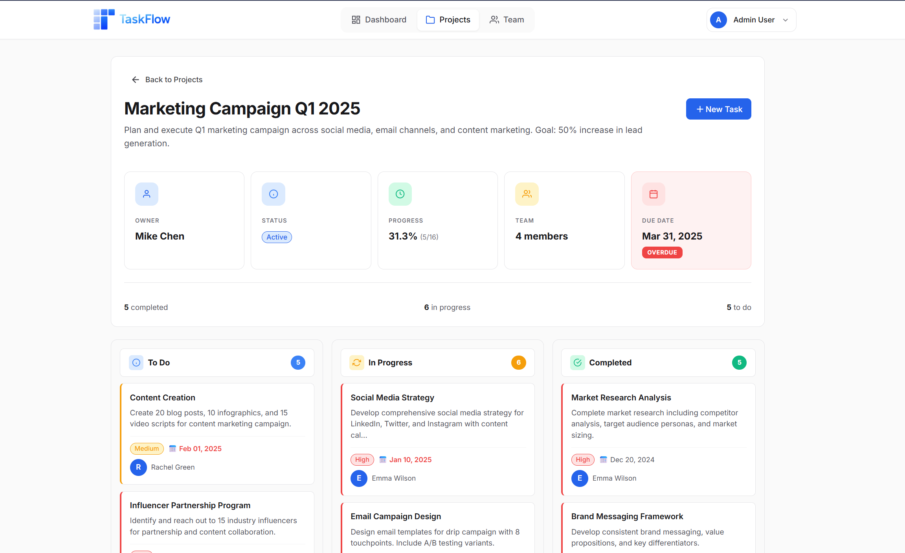

**Task Management Modal**
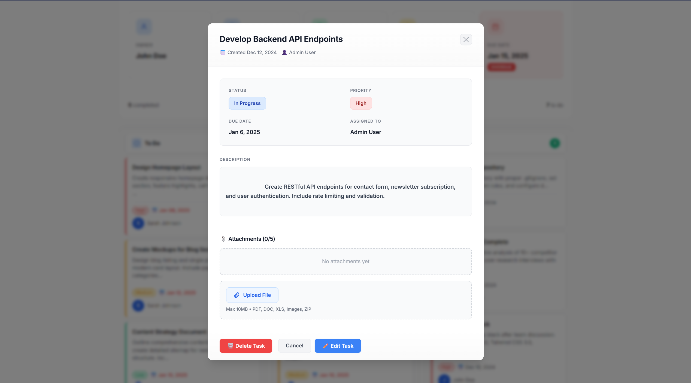

**Projects Overview**
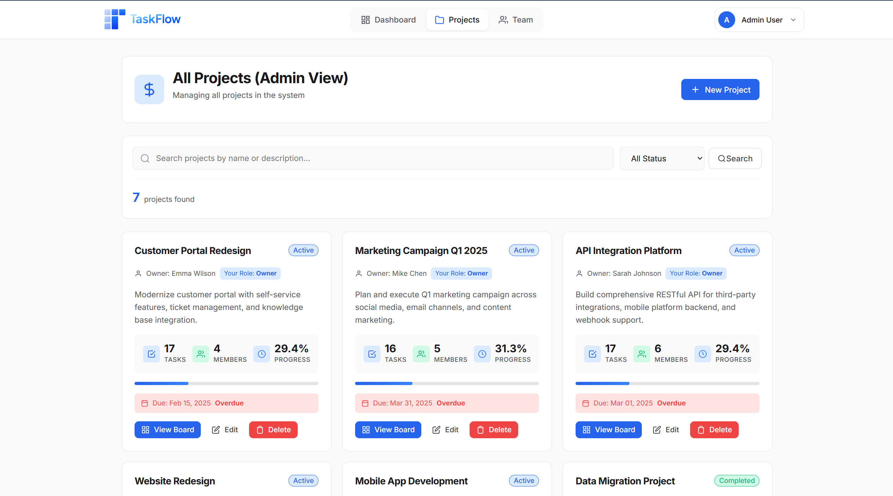

**Dark Mode**
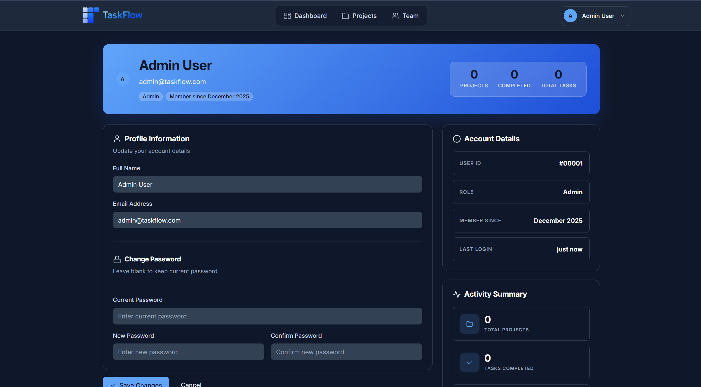

**Team Management**
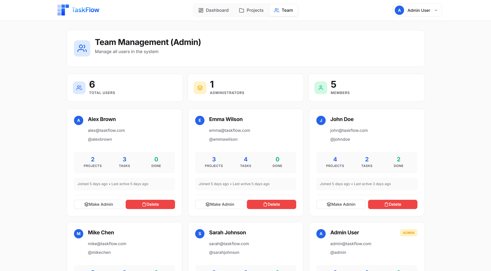

</div>

### Authentication

<div align="center">

**Login Screen** | **Registration Screen**
:-------------------------:|:-------------------------:
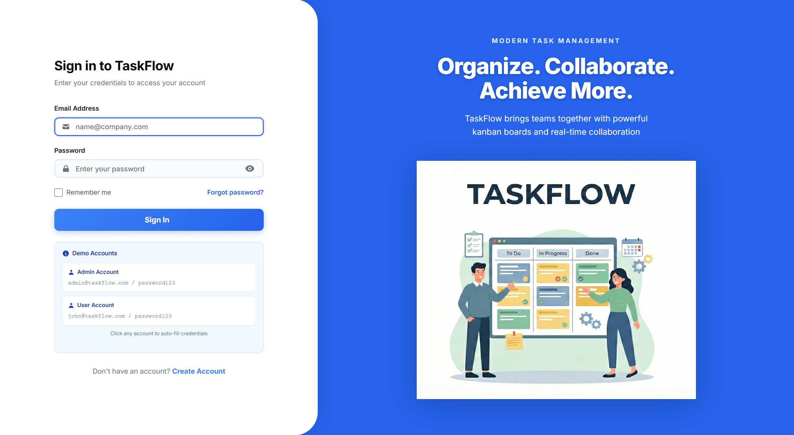 | 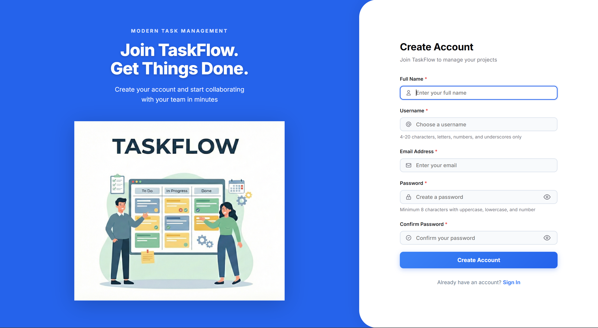

</div>

### Mobile Experience

<div align="center">

**Mobile Dashboard** | **Mobile Navigation** | **Mobile Task View**
:-------------------------:|:-------------------------:|:-------------------------:
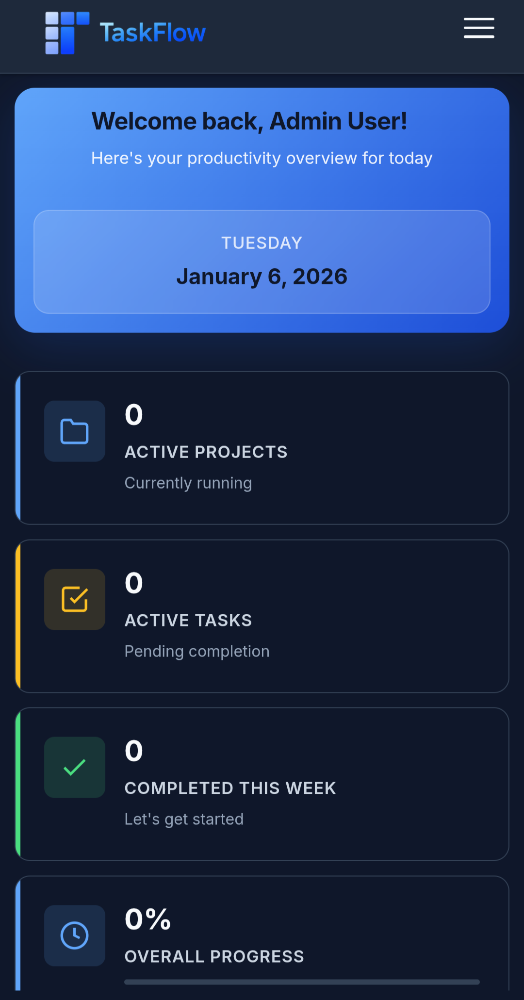 | 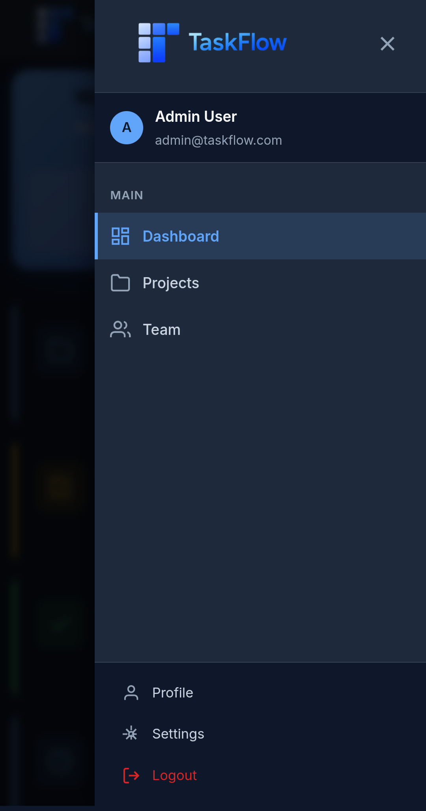 | 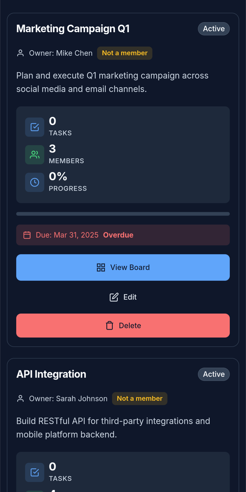

</div>

---

## 🎮 Try It Out

### **🚀 [Live Demo](https://taskflow-wbld.onrender.com)**

TaskFlow comes with pre-configured demo accounts and rich sample data:

**Demo Accounts** (all passwords: `password123`)

| Email | Role | What You Can Test |
|-------|------|-------------------|
| `admin@taskflow.com` | **Admin** | Full system access, user management, delete permissions |
| `john@taskflow.com` | **Project Owner** | Create projects, invite members, manage teams |
| `sarah@taskflow.com` | **Designer** | Task editing, file uploads, kanban workflow |
| `mike@taskflow.com` | **Developer** | Multi-project collaboration, commenting |

**Pre-loaded Demo Data:**
- 8 users with different roles
- 7 projects across various stages
- 119 realistic tasks with descriptions
- 35+ team collaboration comments
- Complete activity audit trail
- Sample file attachments

> **Note:** Demo users (1-8), projects (1-7), and tasks (1-119) are protected from deletion AND editing to maintain portfolio integrity. Create your own test data—it will be automatically cleaned up after 1 hour!

---

## 🛠️ Tech Stack

**Backend:**
- PHP 8.2+ (pure, no frameworks)
- TiDB Cloud (MySQL-compatible distributed SQL)
- PDO for secure database operations
- Session-based authentication

**Frontend:**
- Vanilla JavaScript (ES6+)
- CSS3 with Grid and Flexbox
- HTML5 Drag & Drop API
- AJAX for seamless interactions

**DevOps & Deployment:**
- Docker containerization
- Render.com hosting (free tier)
- cron-job.org for automation
- Git-based auto-deployment
- Environment variables for configuration
- TiDB Cloud (5GB free forever)

---

## 🚀 Deployment

### **Cloud Deployment (Production)**

TaskFlow is deployed using a completely free stack:
- **Render.com** - Free web hosting with Docker support
- **TiDB Cloud** - 5GB MySQL-compatible database (free forever)
- **cron-job.org** - Free external cron service

**Step 1: Set Up TiDB Cloud Database**

1. Go to [TiDB Cloud](https://tidbcloud.com) and create a free account
2. Create a new Serverless Tier cluster (5GB free forever)
3. Note your connection details:
   - Host (e.g., `gateway01.us-west-2.prod.aws.tidbcloud.com`)
   - Port (usually `4000`)
   - Database name
   - Username and password

4. Import the database schema and sample data:
   ```bash
   # Connect to TiDB (use your credentials)
   mysql -h YOUR_HOST -P 4000 -u YOUR_USER -p --ssl-mode=REQUIRED

   # Create database
   CREATE DATABASE taskflow CHARACTER SET utf8mb4 COLLATE utf8mb4_unicode_ci;
   USE taskflow;

   # Import schema
   source sql/database-localhost.sql;

   # Import demo data
   source sql/sample-data-localhost.sql;
   ```

**Step 2: Deploy to Render.com**

1. Fork this repository to your GitHub account

2. Go to [Render.com](https://render.com) and create a free account

3. Click **New +** → **Web Service**

4. Connect your GitHub repository

5. Configure the service:
   - **Name**: `taskflow` (or any name you prefer)
   - **Runtime**: Docker
   - **Plan**: Free
   - **Branch**: main

6. Add environment variables (click **Advanced** → **Add Environment Variable**):
   ```
   DB_HOST=your-tidb-host.tidbcloud.com
   DB_PORT=4000
   DB_NAME=taskflow
   DB_USER=your-tidb-username
   DB_PASS=your-tidb-password
   CLEANUP_TOKEN=your-random-secure-token-here
   ```

7. Click **Create Web Service**

8. Wait for deployment (first build takes 3-5 minutes)

9. Your app will be live at `https://taskflow-xxx.onrender.com`

**Step 3: Set Up Automated Cleanup**

1. Go to [cron-job.org](https://cron-job.org) and create a free account

2. Create a new cron job:
   - **Title**: TaskFlow - Cleanup Temp Users
   - **URL**: `https://your-app.onrender.com/cron/cleanup-temp-users.php?token=YOUR_CLEANUP_TOKEN`
   - **Schedule**: Every 2 hours
   - **Cron Expression**: `0 */2 * * *`
   - **Execute**: At 00:00, 02:00, 04:00, 06:00, 08:00, 10:00, 12:00, 14:00, 16:00, 18:00, 20:00, 22:00 UTC

3. Save and enable the cron job

**What This Does:**
- Automatically deletes test users created more than 1 hour ago
- Protects demo users (IDs 1-8) from deletion
- Keeps your live demo clean and functional
- Runs every 2 hours at the top of the hour

---

### **Local Development**

**Prerequisites:**
- PHP 8.2+
- MySQL 5.7+ (or MariaDB)
- Apache/Nginx (or PHP built-in server)

**Quick Setup:**
```bash
# 1. Clone repository
git clone https://github.com/yourusername/TaskFlow.git
cd TaskFlow

# 2. Create database
mysql -u root -p -e "CREATE DATABASE taskflow CHARACTER SET utf8mb4 COLLATE utf8mb4_unicode_ci;"

# 3. Import schema and data
mysql -u root -p taskflow < sql/database-localhost.sql
mysql -u root -p taskflow < sql/sample-data-localhost.sql

# 4. Configure database connection
cp config/database.example.php config/database.php
# Edit config/database.php with your credentials

# 5. Launch local server
php -S localhost:8000
```

Visit `http://localhost:8000` and login with `admin@taskflow.com` / `password123`

---

## 📚 Documentation

### **📖 [TECHNICAL.md](TECHNICAL.md)** - Technical Deep Dive
Comprehensive technical documentation covering:
- Complete architecture breakdown
- Database schema (8 tables with relationships)
- All 14 RESTful API endpoints
- Security implementations (OWASP Top 10 protection)
- JavaScript module system
- Performance optimizations
- What interviewers will notice

---

## 🔒 Security

TaskFlow implements production-grade security:

- ✅ **Password Security** - Bcrypt hashing with proper cost factors
- ✅ **SQL Injection Protection** - 100% prepared statements via PDO
- ✅ **CSRF Protection** - Token validation on all forms
- ✅ **XSS Prevention** - Proper output escaping
- ✅ **File Upload Security** - MIME type verification, size limits
- ✅ **Session Security** - Regeneration, timeout, secure cookies
- ✅ **Access Control** - Role-based permissions throughout
- ✅ **Demo Data Protection** - Cannot delete or edit protected demo data

**For detailed security implementation, see [TECHNICAL.md](TECHNICAL.md#-security-features)**

---

## 🎯 What Makes This Project Special

### **No Framework Bloat**
Built with pure PHP and Vanilla JavaScript to demonstrate fundamental understanding rather than framework dependency.

### **Production Thinking**
- Docker containerization for consistent deployment
- Environment variables for cloud configuration
- Demo data protection for portfolio stability
- Automated maintenance with external cron service
- Comprehensive error logging
- Security-first development approach

### **Real-World Features**
- Drag-and-drop kanban board
- File attachment system
- Activity logging for compliance
- Role-based access control
- Mobile-first responsive design

### **Modern Development Practices**
- RESTful API design
- MVC-inspired architecture
- Git version control
- Docker containerization
- CI/CD with Git-based auto-deployment
- Cloud-native architecture (Render + TiDB)
- Comprehensive documentation

---

## 📊 Project Stats

| Metric | Value |
|--------|-------|
| **Lines of Code** | 6,500+ |
| **Database Tables** | 8 (normalized to 3NF) |
| **API Endpoints** | 14 RESTful endpoints |
| **JavaScript Modules** | 10 ES6+ modules |
| **CSS Files** | 21 modular stylesheets |
| **Security Measures** | 15+ implemented |
| **Demo Data** | 8 users, 7 projects, 119 tasks |
| **File Support** | 10 types, 10MB limit |

---

## 🤝 Contributing

This is a portfolio project, but feedback is welcome!

**Found a bug?** Open an issue with reproduction steps.

**Have a suggestion?** Open an issue with the `enhancement` label.

---

## 📄 License

This project is licensed under the **MIT License** - see the [LICENSE](LICENSE) file for details.

---

<div align="center">

## ⭐ If TaskFlow Impressed You, Star the Repo!

**Built with precision, deployed with confidence**

---
### **Connect with Me**
[](https://www.linkedin.com/in/mohitrajguru)

---

**TaskFlow v1.0** - Professional Task Management Platform

*Demonstrating full-stack development expertise, one feature at a time*

</div>
